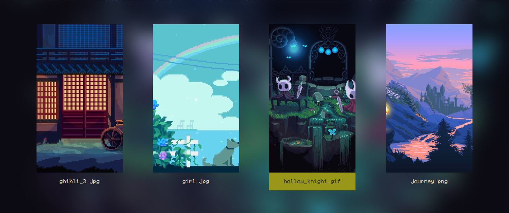

<div align = center>
    <a href="https://discord.gg/AYbJ9MJez7">
            
    </a>
</div>
<div align = center><br><br></div>

> [!IMPORTANT]
> This is not a standalone theme, needs [HyDe](https://github.com/prasanthrangan/hyprdots) installed...

> [!CAUTION]
> Icons dont work in Dolphin use gtk file managers like thunar, nemo, nautilus, etc.....





## Installation
```sh
Hyde theme import "Pixel Dream" https://github.com/rishav12s/Pixel-Dream
```
or 
```sh
Hyde theme import
```
and choose Pixel Dream

---

or install another theme from [HyDe Gallery](https://github.com/kRHYME7/hyde-gallery)